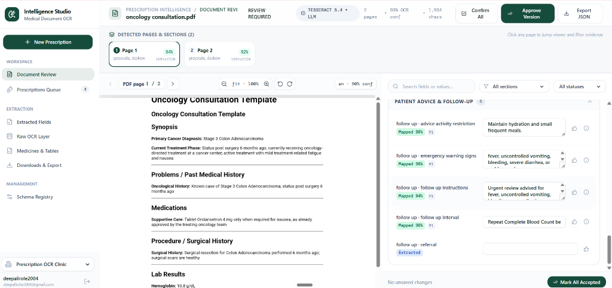
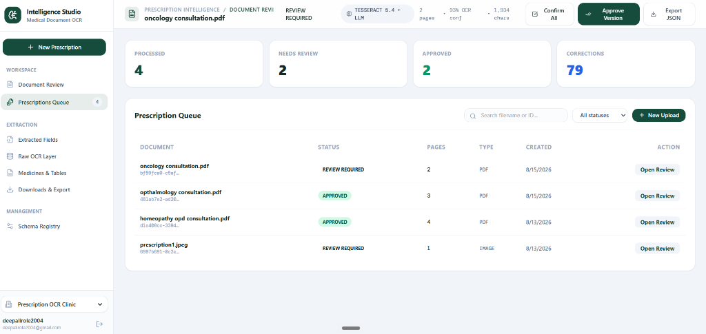
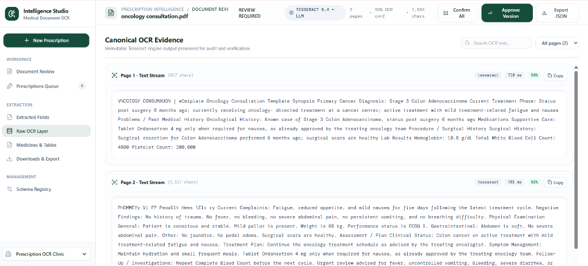
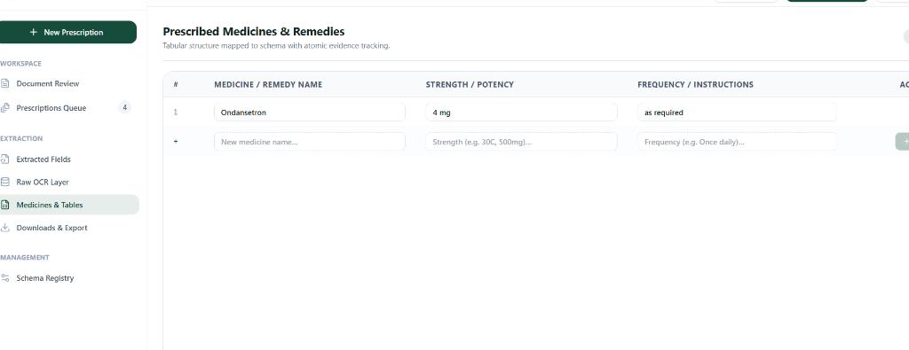
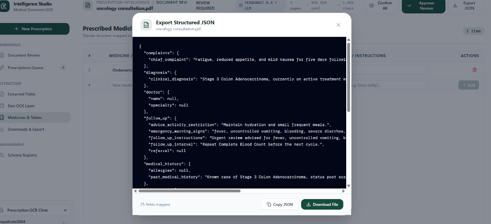

# Prescription Evidence Studio

An evidence-preserving prescription digitization platform built from the version 2.0 PRD in
[PRD.md](PRD.md). It keeps source documents, OCR/HTR evidence, AI extraction, validation,
reviewer corrections, and approved output as separate, auditable stages.

> Medical safety boundary: this system transcribes documents. It does not prescribe, recommend,
> substitute, or silently infer unsupported medical content. Only reviewer-approved versions are
> eligible for downstream integration.

## Application Screenshots

### 1. Document Review & Interactive Verification
Side-by-side verification interface showing the high-resolution prescription viewer, OCR extraction confidence scores, page section tags, and dynamic field editing.



### 2. Prescription Processing Queue
Operational overview tracking total processed documents, items needing review, approved batches, and reviewer correction metrics.



### 3. Canonical OCR Evidence Layer
Immutable OCR text stream preserved per page with character counts, engine execution time, and confidence metrics for clinical audit compliance.



### 4. Prescribed Medicines & Remedies Table
Tabular extraction structure mapped to schemas with atomic evidence tracking, dosage/potency inputs, and dynamic row addition.



### 5. Structured JSON Export
Direct JSON export and inspection modal displaying mapped fields ready for downstream HMIS / EMR consumption.



## Architecture

```text
React + Supabase Auth
        |
        v
FastAPI authorization/orchestration
        |
        +--> Private Supabase Storage (source + derived)
        +--> PDF/image ingestion --> quality --> selective preprocessing
        +--> Tesseract OCR + pluggable HTR --> canonical evidence
        +--> OpenRouter + pinned dynamic schema --> mapper --> validation
        +--> reviewer corrections --> immutable approved version
        `--> Supabase Postgres with organization-scoped RLS
```

The browser receives only the Supabase publishable key. The service-role and OpenRouter keys are
read only by FastAPI.

## Prerequisites

- Python 3.12+
- Node.js 20+
- Supabase project, or Supabase CLI plus Docker for the local stack
- Tesseract executable for real OCR (tests use provider doubles)
- OpenRouter key for semantic extraction (manual review remains available when absent)

## Setup

1. Copy `.env.example` to `.env` and populate the variables. Never commit `.env`.
2. Apply migrations in `supabase/migrations` to a clean Supabase project.
3. Create a user through Supabase Auth, then create an organization and membership. See
   `supabase/seed.sql` for the development pattern.
4. Install and start the backend:

   ```powershell
   cd backend
   python -m pip install -e ".[dev]"
   python -m uvicorn app.main:app --reload
   ```

5. Install and start the frontend in a second terminal:

   ```powershell
   cd frontend
   npm install
   npm run dev
   ```

## Verification

```powershell
cd backend
python -m pytest
python -m ruff check app

cd ../frontend
npm run typecheck
npm test
npm run lint
npm run build
npm audit --audit-level=moderate
```

Run `supabase test db` and `supabase db reset` when the CLI and Docker are available. SQL-level
RLS assertions live in `supabase/tests/rls_policies.sql`; backend security tests also verify that
every exposed application table enables RLS and both storage buckets remain private.

The local automated gate also parses every migration and pgTAP file as PostgreSQL syntax, verifies
all FastAPI method/path pairs are unique, scans the frontend for privileged secret names, and runs a
production Vite bundle plus dependency audit.

## API surface

- Foundation: `/health`, `/api/me`, `/api/organizations`.
- Schemas: list/create/read/update/delete/activate under `/api/prescription-schemas`.
- Pipeline: upload, process/resume, detail, status, signed preview, and raw OCR under
  `/api/prescriptions`.
- Review: dynamic fields, single/bulk corrections, repeatable row add/remove, approval, final JSON.
- Operations: paginated prescriptions, organization metrics, admin diagnostics.
- Integration: `/api/prescriptions/{id}/integration-payload` exports approved versions only; see
  [docs/INTEGRATION_CONTRACT.md](docs/INTEGRATION_CONTRACT.md).
- HMIS/EMR (P4): `/api/integrations/hmis/health`, `/api/prescriptions/{id}/hmis-preview`, and
  `/api/prescriptions/{id}/hmis-dispatch` push approved snapshots into the Medikunj schema;
  `/api/integrations/emr/health` and `/api/prescriptions/{id}/emr-dispatch` do the same into a
  FHIR R4 EMR. Both destinations are inert until `HMIS_PROVIDER` / `EMR_PROVIDER` are set.
- Assistance (P4): `/api/prescriptions/{id}/schema-suggestions`,
  `/api/prescriptions/{id}/medicine-suggestions`, `/api/assistance/medicines`, and
  `/api/assistance/prompt-versions`. All are advisory and mutate nothing.
- Approvals (P4): `/api/prescriptions/{id}/approval-status` and `.../approval-steps` drive the
  multi-stage sign-off chain that gates the immutable approved version.
- Background/realtime (P4): `POST|GET /api/prescriptions/{id}/process-async`,
  `/api/prescriptions/{id}/progress-stream` (SSE), and `/api/admin/worker-pool`.
- Feedback (P4): `/api/organizations/{id}/feedback-dataset` and `.jsonl` export approved-only
  reviewer corrections for evaluation; admin-only and free of reviewer identity.

`Idempotency-Key` is supported by the processing endpoint. Duplicate uploads are also protected by
an organization/source SHA-256 constraint. Failed OCR can resume from persisted derived pages, and
failed LLM extraction leaves raw evidence plus null review fields available for manual completion.

## Extension points

- OCR providers implement `OCREngine` and return canonical evidence. Tesseract (default),
  PaddleOCR, Google Vision, and Azure Document Intelligence ship in-tree and are selected with
  `OCR_PROVIDER`; PaddleOCR is an optional extra (`pip install -e ".[paddle]"`).
- HTR providers implement `HTREngine`; an unconfigured provider returns `HTR_NOT_CONFIGURED`
  without breaking printed OCR. TrOCR ships in-tree behind `HTR_PROVIDER=trocr` and the
  optional `trocr` extra.
- Any `OCREngine`/`HTREngine` can be scored against a labelled corpus with
  `python -m app.services.benchmark <dataset-dir>`, which reports CER, WER, latency, and
  confidence calibration per provider.
- Extraction prompts are immutable and versioned in `app.services.llm.prompt_registry`; every
  extraction run records the prompt version and digest it ran under.
- LLM providers implement `LLMProvider`; OpenRouter is the production adapter.
- Dynamic schemas are data, not form code. Nested objects and arrays are handled by the mapper and
  the React dynamic renderer.
- Medical Bill & Pharmacy Receipt Support: Dedicated extraction schemas for hospital invoices,
  pharmacy cash memos, and medical bills with itemized medicine tables, batch/unique codes, unit prices,
  quantities, discounts, and financial grand totals.
- Dual Export (JSON & Excel): One-click export to structured JSON and formatted Microsoft Excel
  (`.xlsx` / `.csv`) workbooks with styled provider, patient, and billing summary blocks.
- Downstream destinations consume only immutable approved snapshots.
- HMIS/EMR destinations implement `HMISConnector` and are selected by `HMIS_PROVIDER` /
  `EMR_PROVIDER`; an unconfigured destination returns `HMIS_NOT_CONFIGURED` /
  `EMR_NOT_CONFIGURED` while mapping and preview still work. Destination column mapping is data
  (`MedikunjFieldMapping`), and the repeatable medicine section is located by schema type rather
  than by field name.
- Approval chains are data: a row in `approval_workflows` defines the stages. An organization
  with no row keeps the original single reviewer sign-off.

See [IMPLEMENTATION_STATUS.md](IMPLEMENTATION_STATUS.md) for verified progress and environment
limitations.
